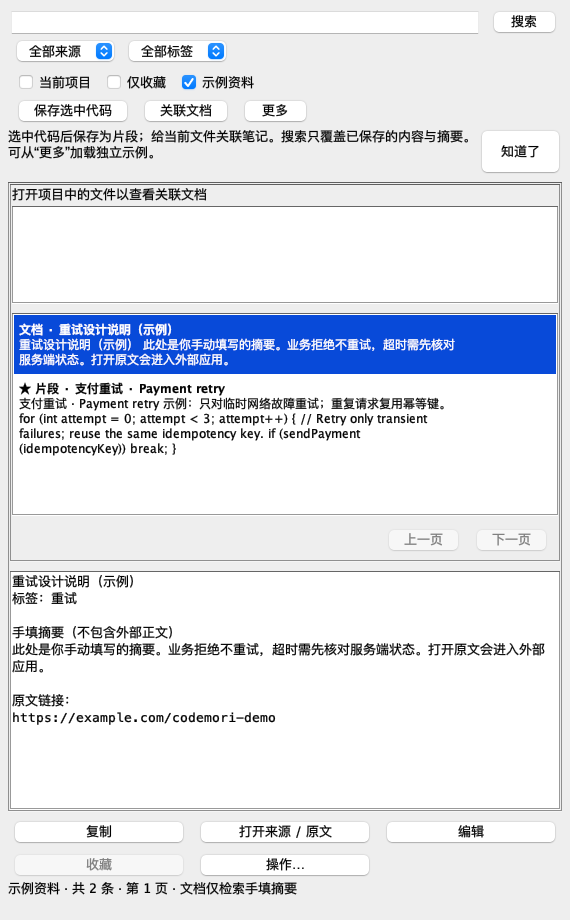

# JetBrains 使用说明

## 安装

在 IDE 的 Settings/Preferences → Plugins 中选择 Install Plugin from Disk，选择[下载说明](download.md)中匹配本机平台的 JetBrains ZIP，然后按 IDE 提示重新加载。当前本地预览包在 `target/dist/`；不要求用户编译。打开项目后，从右侧工具窗口或 Find Action → `CodeMori: 搜索资料` 打开面板。第一次保存与关联见[入门指南](quickstart.md)。

默认数据目录为 `~/.codemori/`，无需另装桌面客户端。打开面板会按需初始化本地资料库。

从源码开发时可在 `plugins/jetbrains` 运行 `./gradlew test buildPlugin verifyPluginStructure`；生成包在 `build/distributions/`。开发沙箱请隔离数据：

```sh
./gradlew -PcodemoriTestDataDir="$PWD/build/qa-data" runIde
```

可附加 `-PlocalIdePath="/path/to/IDE"` 使用本地 SDK，附加 `-PcodemoriTestProject="/path/to/test-project"` 指定测试项目。沙箱实例与日常 IDE 的配置目录分开。

## 保存和查找

1. 在编辑器选择代码，右键 → `CodeMori: 保存选中代码`；也可点击面板中的“保存选中代码”。
2. 填写标题、场景描述和可选标签；标签输入框补全已有标签。语言留空时由核心根据来源扩展名识别。
3. 搜索框支持中文子串、中英文混合和多个关键词同时匹配。按 Enter 立即查询，或停止输入约 100 ms 后查询。
4. 可以按来源、标签、当前项目、收藏筛选；搜索结果展示命中上下文和来源项目。
5. 选择结果可预览、复制、编辑、收藏；“操作…”中提供删除和文档关联操作。删除前会确认，不会删除源代码或外部文档。

片段是保存时的快照。来源文件之后发生变化不会修改片段；“打开来源”使用保存时的路径和参考行号。

## 文档与文件关联

在项目中打开源码文件，选择“关联文档”，填写标题、链接和可选摘要。支持 HTTP(S)、Obsidian open URI 和本地文档路径。

当前文件区域显示关联文档。搜索到已有文档后，也可从“操作…”关联到当前文件。同一链接复用已有文档记录；修改标题或摘要请使用“编辑”。解除文件关联保留文档记录。

**搜索只覆盖保存的标题、标签和手填摘要，不读取外部文档正文。** 摘要在 IDE 内查看；打开原文可能切换到浏览器或 Obsidian。本地文件通过 IDE 打开，不作为程序执行。

文件移动后，可从“操作…”→“查看 / 修复关联位置”调整相对路径。片段来源路径在编辑表单中可修复。整个项目移动后，从“更多”→“重新定位工作区”选择新根目录。

## 备份与冲突

“更多”中可以导出完整 JSON 备份，或选择备份文件先预览再导入。冲突保留本机版本；无效备份不产生部分数据写入。导出内容包括片段、标签、文档记录、工作区和关联，不包含外部文档正文。

编辑遇到其他客户端的更新时，保存会被拒绝并保留当前草稿。请刷新并比较最新记录后重新编辑，不会静默覆盖对方修改。

## 验证范围

平台测试已覆盖面板搜索、收藏、复制、删除、表单保存、冲突草稿、编辑器选区捕获，以及从已加载插件解析随包 CLI。以下预览来自平台测试中的组件渲染，**不是操作系统窗口的完整手工验收截图**。



## 注释与本地预览

“更多”可手动索引当前文件或增量索引工作区内已保存的源码，搜索结果中的“源码注释”标签页显示第三种来源，双击或 Enter 跳转。选择本地 Markdown 文档后，从“操作…”进入只读预览。支持语言、忽略规则和正文边界见 [索引与预览](indexing.md)。

飞书文档另有 **在飞书中打开** 按钮，可直接请求客户端打开；保留原始链接和浏览器入口。支持范围及桌面限制见[飞书打开说明](feishu-opening.md)。

## 项目共享

保存窗口可选择个人资料或项目共享；共享资料随项目 `.codemori/shared.json` 提交到 Git，两端显示来源并在文件变化后刷新。新建默认个人，编辑保持所属库；收藏仅属于个人。详见[团队使用与冲突处理](project-sharing.md)。

## 文档回跳代码与署名

源码中使用“复制代码位置链接”，把链接贴进文档；将项目 `.codemori/project.json` 提交给同事。文档平台不能点击时，使用“打开代码位置链接”粘贴。详见[代码链接指南](code-links.md)。首次共享写入会提示设置显示名，列表显示创建者和最近修改者；团队应一起升级到当前0.1.0；共享文件写入格式3并保留署名和复核信息，详见[署名和旧资料迁移](project-sharing.md)。

## 文档提示、模块继承与复核

关联窗口可选“当前目录（含子目录）”；面板显示继承来源、代码是否变化及最后确认信息。代码旁提示默认显示，可从设置/更多菜单隐藏，关联资料保留。当前文件文档可查看Git差异（需可用基线）和确认仍适用；文件/目录移动后可预览并批量修复。新代码链接带内容/符号锚点。详见[完整操作及升级说明](contextual-knowledge.md)。

## 一键复核与skill

当前文件关联区可一次确认显示的待复核项，包含继承模块；会检查版本和代码指纹并分别报告个人/共享结果。CLI压缩包还提供 `codemori-knowledge` Skill，供AI查找实现、读取关联知识并生成文档草稿。详见[使用与安装](ai-skill.md)。
